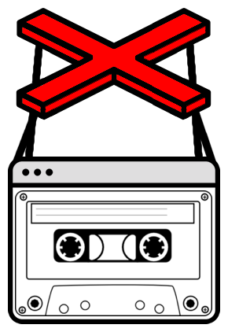

<p align="center">
<br>
<strong>Mockeer</strong>
<br>
Mocking library for Puppeteer!
</p>
<br>

## About
Mockeer is a [Puppeteer](https://github.com/GoogleChrome/puppeteer) helper library to run chrome headless browser in isolation.

## How it works
Mockeer works by overriding Puppeteer's Request event and providing mock responses.

Mockeer works in `Record` and `Play` mode. In record mode it intercepts browser requests and saves them as json fixtures. In play mode it just replay those saved responses.

## Installation

```bash
$ npm install mockeer
```

## Usage
```js
const mockeer = require('mockeer');
const puppeteer = require('puppeteer');

(async () => {
  const browser = await puppeteer.launch();
  const page = await browser.newPage();
  await mockeer(browser);
  await page.goto('https://www.example.com');
  await page.close();
  await browser.close();
})();
```
Save above script as `index.js`

- `Record` mode
```bash
> node index.js
```
- `Play` mode
```bash
> CI=true node index.js
```

See more examples [here](./src/tests/integration/integration.int.test.js)

See full list of configs [below](https://github.com/NimaSoroush/mockeer#globaloptions)


## API

See [API.md](API.md) for full list of API calls

## GlobalOptions

|Parameter|type|required|description|default|
|---------|----|--------|-----------|-------|
|`page`|`object`|no|If puppeteer page object passed, only mock responses for that page will be recorded|null|
|`fixturesDir`|`string`|no|Path to generated fixture files|`./__mockeer_fixture__`|
|`fixtureName`|`string`|no|Path to generated fixture name|`chrome-http-mocks`|
|`replaceImage`|`boolean`|no|Replace images with template image|false|
|`replaceIfExists`|`boolean`|no|Replace fixtures even when they already recorded|true|
|`allowImageRecourses`|`boolean`|no|If enabled image resources will be fetched from origin and not intercepted in play mode|false|
|`disallowedResourceTypes`|`array`|no|You can filter what type of requests and data you wanna mock into your fixtures creating a blacklist of [sourceTypes](https://pptr.dev/#?product=Puppeteer&version=v1.20.0&show=api-requestresourcetype) provided by Puppteer|[]|
|`svgTemplate`|`string`|no|A SVG image template that will replace images in the page|A solid gray svg image. Source [here](src/utils/svg-template.js)|

    : ['image', 'script', 'stylesheet']


## Links

See [examples](./src/integration.tests) for usages and CI integration with jest

Visit project [Slack Chat](https://mockeer.slack.com) for general Q/A around project

See [CONTRIBUTING.md](CONTRIBUTING.md) if you want to contribute.

[Gist example](https://gist.github.com/NimaSoroush/f611dcdf8911b2d9e903267324214562) with vanilla node
